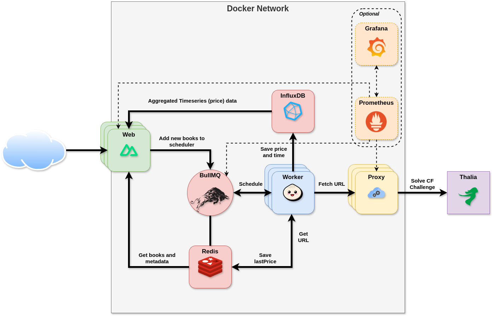
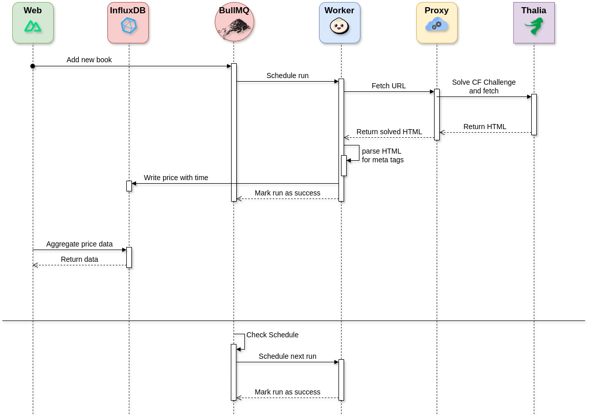

# Thalia book price tracker

Track the pricing of books over time.

## Tech

### Infrastructure

[Nuxt](https://nuxt.com/) is used as an integrated solution for the front and back end. The backend, based on Nitro
endpoints, requests data
from the Influx and Redis database and sends it to the frontend. If another book is to be tracked, a new schedule is
inserted via [BullMQ](https://bullmq.io/). Both the Nuxt application and the worker run using [Bun](https://bun.sh/).



The web, worker and proxy container can be scaled as pleased, because of the included "load balancing" of docker network
using DNS.

### Fetching price data - Sequence diagram



## Setup

Make sure to install dependencies:

```bash
# bun
cp .env.example .env
# now change the values
docker compose up -d


bun install

cd queue
bun install
```

## Development Server

Start the development server on `http://localhost:3000`:

```bash
# bun
bun run dev

cd queue
bun run worker
```

## Production

Copy both the `docker-compose.yml` and `.env.example`, change the parameters to your liking and then start the stack:

```bash
cp .env.example .env
# now change the values

docker compose --profile prod pull
docker compose --profile prod up -d
```
